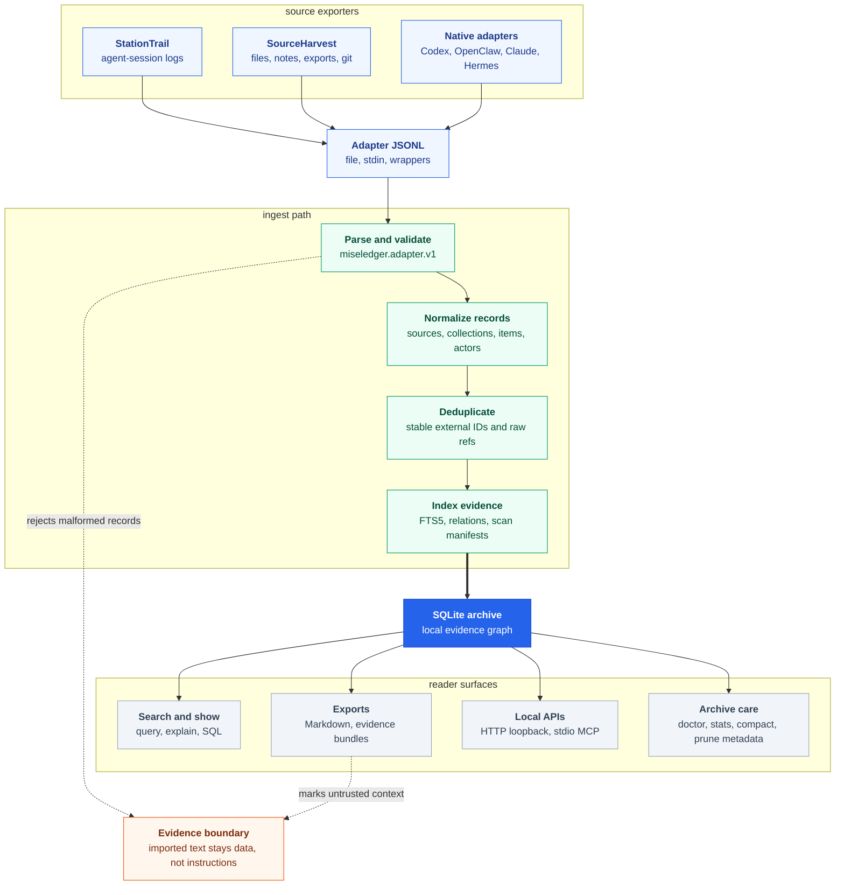
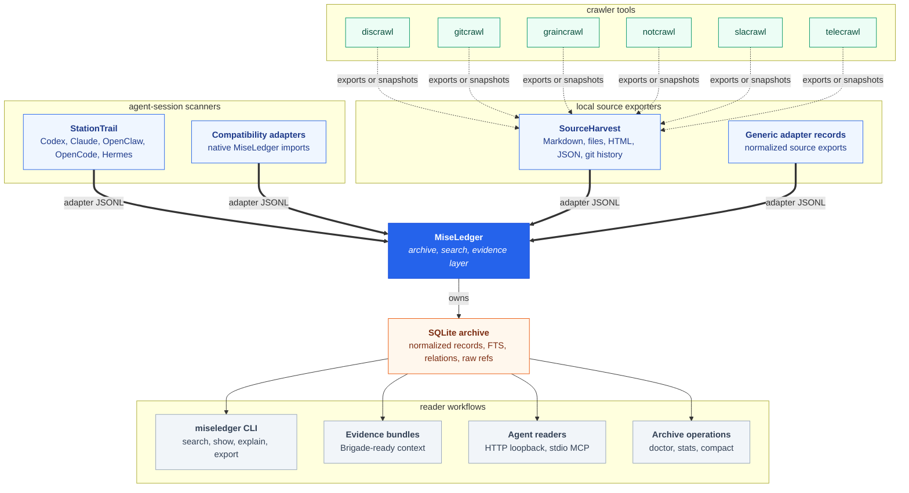

# MiseLedger

MiseLedger turns scattered AI work history into a local searchable evidence graph.

The MVP is a local-first CLI named `miseledger`. It imports `miseledger.adapter.v1` JSONL records into SQLite, preserves raw payload references, searches with SQLite FTS5, shows normalized items, exports Markdown, emits Brigade-ready evidence bundles, and allows read-only SQL inspection.

Each source system is best at its native domain:

- [StationTrail](https://github.com/escoffier-labs/stationtrail): Codex, Claude, OpenClaw, OpenCode, Hermes, and related local session logs
- [SourceHarvest](https://github.com/escoffier-labs/sourceharvest): local files, notes, generic exports, git history, and future crawler adapter exports
- `discrawl`: Discord messages
- `gitcrawl`: GitHub issues and pull requests
- `graincrawl`: Granola notes and transcripts
- `notcrawl`: Notion pages and databases
- `slacrawl`: Slack messages and threads
- `telecrawl`: Telegram Desktop archive data

MiseLedger is the normalized evidence layer above those systems, not a replacement for them.

## How It Works



MiseLedger follows one ingest path:

1. Receive `miseledger.adapter.v1` JSONL from a file, stdin, StationTrail, SourceHarvest, or a native compatibility adapter.
2. Parse and validate each adapter record.
3. Store normalized sources, collections, items, actors, artifacts, raw refs, tags, imports, warnings, and scan manifests in SQLite.
4. Deduplicate repeat records and preserve raw payload references for audit.
5. Maintain FTS5 search indexes and shallow relations.
6. Serve search, show, explain, export, HTTP, MCP, and evidence-bundle workflows from the local archive.

## Stack Map



StationTrail owns local agent-session scanning. SourceHarvest owns non-agent local source export normalization. MiseLedger owns archive ingest, SQLite, FTS, relations, scan manifests, reader APIs, and evidence bundles.

Crawler tools keep their native sync/query behavior. Their local exports, snapshots, or databases should flow through SourceHarvest before entering MiseLedger.

## Build

```bash
go build -o bin/miseledger ./cmd/miseledger
```

You can also run commands with:

```bash
go run ./cmd/miseledger --help
```

Install from a release:

```bash
curl -fsSL https://raw.githubusercontent.com/escoffier-labs/miseledger/HEAD/install.sh | sh
```

For a first archive and agent integration path, see [docs/QUICKSTART.md](docs/QUICKSTART.md). For MCP client configuration, see [docs/MCP.md](docs/MCP.md). For roadmap and cookbook material, see [docs/ROADMAP.md](docs/ROADMAP.md), [docs/EXAMPLES.md](docs/EXAMPLES.md), [docs/QUERY_COOKBOOK.md](docs/QUERY_COOKBOOK.md), [docs/STATIONTRAIL_PARITY.md](docs/STATIONTRAIL_PARITY.md), [docs/LIVE_DRY_RUN_CHECKLIST.md](docs/LIVE_DRY_RUN_CHECKLIST.md), and [docs/INSTALL_SMOKE.md](docs/INSTALL_SMOKE.md).

## Runtime Paths

MiseLedger uses XDG paths when present:

- config: `~/.config/miseledger/config.toml`
- data: `~/.local/share/miseledger/miseledger.db`
- cache: `~/.cache/miseledger/`

Directories and files created by the CLI use private permissions.

## Smoke Test

```bash
miseledger init
miseledger import adapter testdata/adapters/discrawl.fixture.jsonl --source discrawl
miseledger import adapter testdata/adapters/agent-session.fixture.jsonl --source codex
miseledger adapter codex testdata/harnesses/codex-session.fixture.jsonl --out -
miseledger adapter hermes testdata/harnesses/session_hermes-demo.fixture.json --out -
miseledger import codex testdata/harnesses/codex-session.fixture.jsonl --json
miseledger import openclaw testdata/harnesses/openclaw-session.fixture.jsonl --json
miseledger import claude testdata/harnesses/claude-project.fixture.jsonl --json
miseledger import hermes testdata/harnesses/session_hermes-demo.fixture.json --json
miseledger status --json
miseledger scans list --json
miseledger sources discover --json
miseledger search "adapter contract" --json
miseledger evidence "adapter contract" --json
miseledger evidence show <bundle-id> --json
miseledger explain "adapter contract" --json
miseledger show <returned-item-id> --json
miseledger export markdown --out /tmp/miseledger-md
miseledger relations backfill --json
miseledger stats --json
miseledger compact --json
miseledger prune imports --before 2026-01-01 --dry-run --json
miseledger sql "select count(*) as items from items" --json
miseledger doctor --json
miseledger doctor --mcp --json
miseledger doctor --archive --json
```

Re-running the same imports is idempotent and does not increase item counts.

## Native Session Adapters

Native adapter generators convert local session JSON and JSONL into `miseledger.adapter.v1` records:

```bash
miseledger adapter codex ~/.codex/sessions --out codex.adapter.jsonl --limit 100
miseledger adapter openclaw ~/.openclaw/agents --out openclaw.adapter.jsonl --since 2026-06-01
miseledger adapter claude ~/.claude/projects --out claude.adapter.jsonl --limit 100
miseledger adapter hermes ~/.hermes/sessions --out hermes.adapter.jsonl --limit 100
```

Native import commands stream generated adapter records into the same adapter ingest path:

```bash
miseledger import codex ~/.codex/sessions --json
miseledger import openclaw ~/.openclaw/agents --json
miseledger import claude ~/.claude/projects --json
miseledger import hermes ~/.hermes/sessions --json
miseledger import codex testdata/harnesses/malformed-unknown.fixture.jsonl --dry-run --json
miseledger import discovered --json
miseledger watch once --json
miseledger watch once --if-changed --json
```

The scanners accept a file or directory, walk relevant JSON and JSONL files recursively, skip obvious backups and sidecars, preserve raw refs, and warn rather than crash on malformed or unknown events. Hermes native support covers `session_*.json` snapshots and trajectory JSONL under `~/.hermes/sessions`; Hermes `state.db` is not parsed directly.

## External StationTrail Scanner

StationTrail is the separate local agent-session scanner/exporter. It keeps source-specific harness parsing outside MiseLedger and emits the same `miseledger.adapter.v1` JSONL contract:

```bash
stationtrail discover --json
stationtrail doctor --json
stationtrail doctor --live --json
stationtrail codex ~/.codex/sessions --dry-run --json
stationtrail all --out - --redact paths,secrets | miseledger import adapter -
stationtrail claude ~/.claude/projects --out - | miseledger import adapter -
stationtrail openclaw ~/.openclaw/agents --out openclaw.adapter.jsonl
stationtrail hermes ~/.hermes/sessions --out - | miseledger import adapter -
miseledger import adapter openclaw.adapter.jsonl --json
```

When `stationtrail` is installed on `PATH`, MiseLedger can run it directly:

```bash
miseledger import stationtrail codex ~/.codex/sessions --json
miseledger import stationtrail claude ~/.claude/projects --json
miseledger import stationtrail openclaw ~/.openclaw/agents --json
miseledger import stationtrail opencode opencode-session.json --json
miseledger import stationtrail hermes ~/.hermes/sessions --json
```

The wrapper streams StationTrail output through adapter ingest and records StationTrail scan manifests from its summary output. For mixed-source imports, use `stationtrail all --out - | miseledger import adapter -`; each adapter record still carries its own `source.kind`.

MiseLedger native adapters remain available for compatibility. Long term, source-specific agent-session parser ownership should live in StationTrail while MiseLedger owns archive ingest, SQLite, FTS, relations, scan manifests, and evidence bundles.

## External SourceHarvest Scanner

SourceHarvest is the separate local source-system exporter for non-harness records such as notes, generic JSONL exports, local crawler outputs, and future domain harvesters:

```bash
sourceharvest jsonl export.jsonl --source notes --collection notes:local --out - | miseledger import adapter -
sourceharvest markdown ./notes --source notes --collection notes:local --out - | miseledger import adapter -
```

When `sourceharvest` is installed on `PATH`, MiseLedger can run it directly:

```bash
miseledger import sourceharvest markdown ./notes --source notes --collection notes:local --json
miseledger import sourceharvest files ./notes --source notes --collection notes:files --glob "*.md,*.txt" --json
miseledger import sourceharvest html ./site-export --source docs --collection docs:html --json
miseledger import sourceharvest gitlog . --source gitlog --collection repo:miseledger --json
miseledger import sourceharvest json export.json --source export --collection export:records --records-path records --json
```

Use StationTrail for agent-session logs. Use SourceHarvest for other local source-system exports. MiseLedger remains the archive, search, relation, and evidence layer for both.

Planned crawler adapter imports should keep this shape once SourceHarvest has real schema-backed adapters:

```bash
miseledger import sourceharvest discrawl ~/.local/share/discrawl/discrawl.db --json
miseledger import sourceharvest telecrawl ~/.local/share/telecrawl/telecrawl.db --json
```

## Scan Manifests

Native imports record which local source files MiseLedger has seen without exposing transcript text:

```bash
miseledger scans list --json
miseledger scans list --source codex --json
miseledger scans show <id-or-path> --json
miseledger scans diff <path> --json
miseledger scans changed --source codex --json
```

Manifest rows include source kind, path, size, mtime, content hash, generated adapter hash, first/last seen timestamps, last imported timestamp, generated record count, and warning count.

## Archive Operations

Archive maintenance commands are local-only:

```bash
miseledger stats --json
miseledger relations backfill --json
miseledger compact --json
miseledger prune imports --before 2026-01-01 --dry-run --json
miseledger prune scans --missing --dry-run --json
miseledger doctor --archive --json
```

`stats` summarizes archive contents by source, item kind, actor type, collection kind, and recent imports. `relations backfill` resolves stored `target_external_id` values after later imports add the target item. `compact` checkpoints, analyzes, vacuums, and optimizes the SQLite archive. `prune imports` removes old import metadata and warning rows only. `prune scans --missing` removes scan manifest rows for files no longer present. Neither prune command deletes normalized evidence items.

`doctor --archive` checks SQLite quick-check status, foreign keys, orphan rows, unresolved relations, FTS coverage, and missing scan paths. It reports counts and status only, not transcript content.

## Source Discovery

Discovery reports candidate roots and supported file counts only:

```bash
miseledger sources discover --json
```

It checks Codex sessions, OpenClaw agents, Claude projects, and Hermes session files without printing private transcript content.

## Local API and MCP

The local HTTP API binds to loopback only by default:

```bash
miseledger serve --addr 127.0.0.1:8765
curl "http://127.0.0.1:8765/search?q=auth+timeout"
curl "http://127.0.0.1:8765/items/<item-id>"
curl -X POST http://127.0.0.1:8765/evidence -d '{"query":"auth timeout","limit":10}'
```

The stdio MCP server exposes `search_evidence`, `show_item`, `create_evidence_bundle`, `show_evidence_bundle`, and `list_sources`:

```bash
miseledger mcp
miseledger doctor --mcp --json
```

Fixture smoke scripts exercise these surfaces without private transcript content:

```bash
scripts/bootstrap_local.sh
scripts/smoke_http.sh
scripts/smoke_mcp.sh
```

## Evidence

Brigade-facing evidence bundles are structured and explicitly untrusted:

```bash
miseledger evidence "auth timeout" --source discrawl --limit 20 --json
miseledger evidence "Claude native import" --project miseledger --json
miseledger evidence "adapter contract" --include-related --json
miseledger evidence "adapter contract" --include-artifact-text --json
miseledger evidence "adapter contract" --markdown
miseledger evidence show <bundle-id> --json
miseledger evidence list --json
miseledger explain "adapter contract" --source codex --json
```

Evidence output includes a stable bundle `id`, a `miseledger://evidence/<id>` resource URI, the query, filters, generated timestamp, result item IDs, snippets, FTS scores, source and collection context, actor context, raw refs, artifact refs, source grouping, optional related items, optional artifact text, and warnings. Evidence results dedupe repeated content hashes. Generated bundles are cached under MiseLedger's private cache directory and can be shown later with `miseledger evidence show`.

`explain` uses the same FTS path as `search` and reports the quoted FTS query, filters, result count, source and item-kind counts, and top result IDs/snippets.

## Relations

MiseLedger resolves shallow relations during import when the target item already exists in the same source:

- Codex function/tool call results link back to calls by `call_id`.
- Claude `tool_result` records link back to `tool_use` records by `tool_use_id`.
- OpenClaw session/run events preserve `belongs_to_session` and `belongs_to_run` relations when session or run identifiers are present.

If a target is not present yet, MiseLedger preserves `target_external_id` for later inspection.

## Privacy

MiseLedger does not make network calls for init, adapter generation, import, search, evidence, show, export, status, SQL inspection, MCP, HTTP serving, or doctor. Imported text is stored locally and treated as untrusted evidence, not executable instructions.
